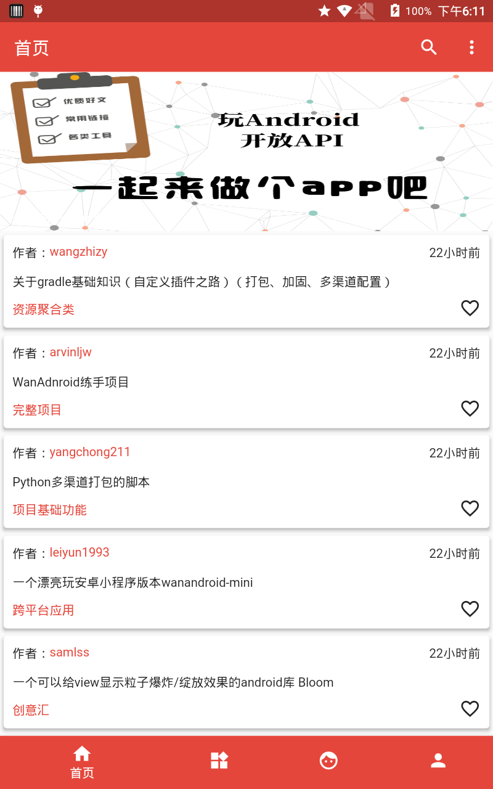

# wanandroid_flutter

玩Android - Flutter版

## 应用截图

|  |  |  |  |  |
| :--: | :--: | :--: | :--: | :--: |
| 首页 | 妹子 | 妹子 | 妹子 | 妹子|

### 第三方框架

库 | 功能
-------- | ---
**http**|**网络框架**
**dio**|**flutterchina - 网络框架**
**shared_preferences**|**本地数据缓存**
**fluttertoast**|**toast**
**iconfont**|**字库图标**
**share_extend**|**系统分享**
**cached_network_image**|**缓存Image**
**flutter_webview_plugin**|**全屏的webview**
**photo_view**|**图片预览**
**flutter_swiper**|**广告**
**event_bus**|**EventBus事件**
**flukit**|**flutterchina - flukit**
**plugins**|**flutterchina - plugins**
**common_utils**|**常用工具包**

## todo 
- [x] 首页
- [x] 发现
- [x] 妹子
- [x] 我的
- [x] 登录
- [x] 侧滑
- [ ] 搜索
- [ ] 多语言
- [ ] 主题
